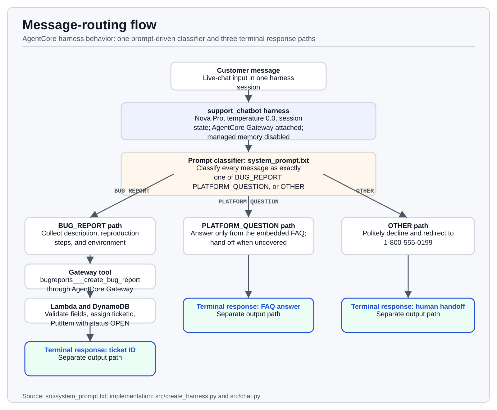
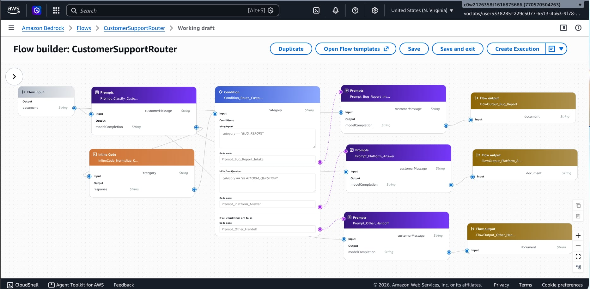
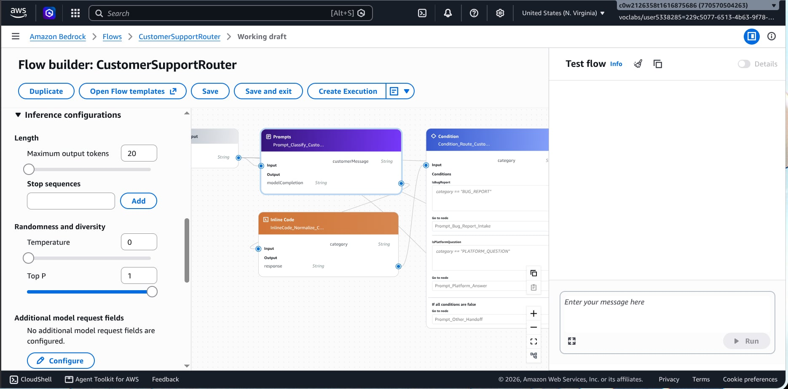
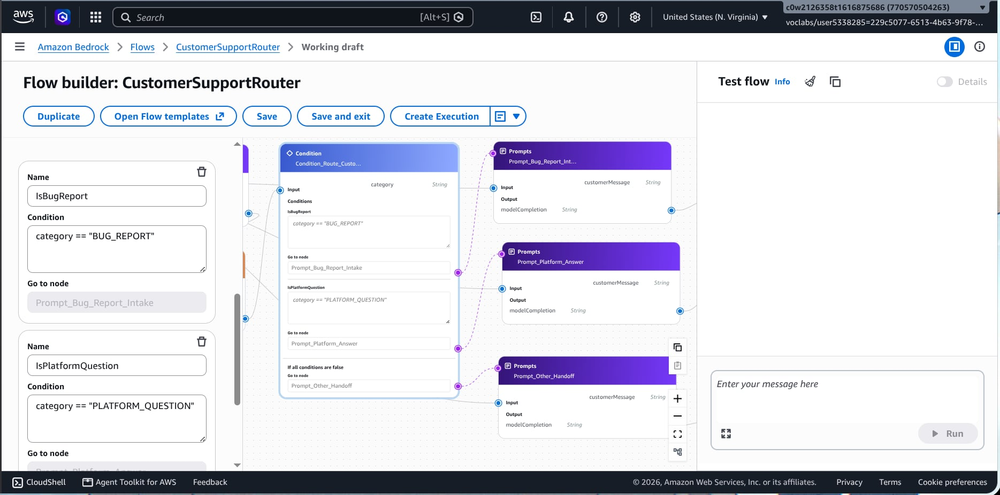
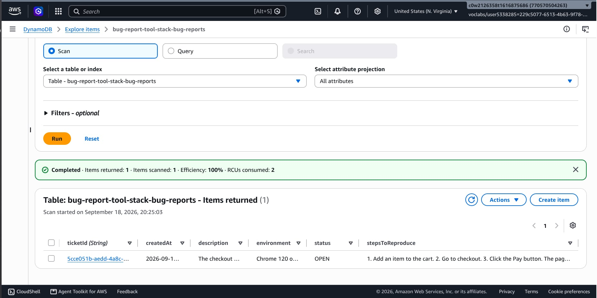
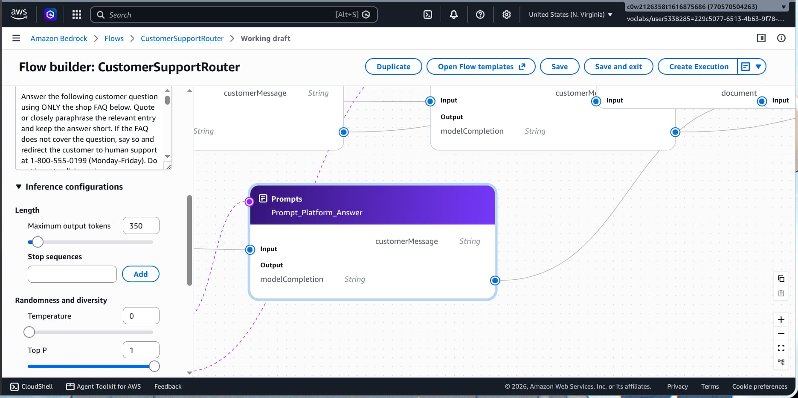
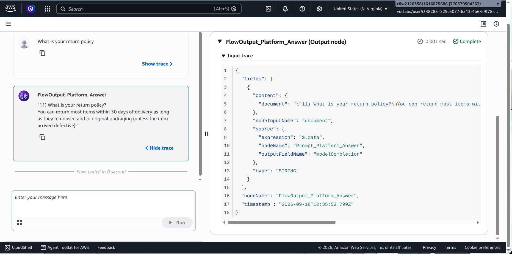
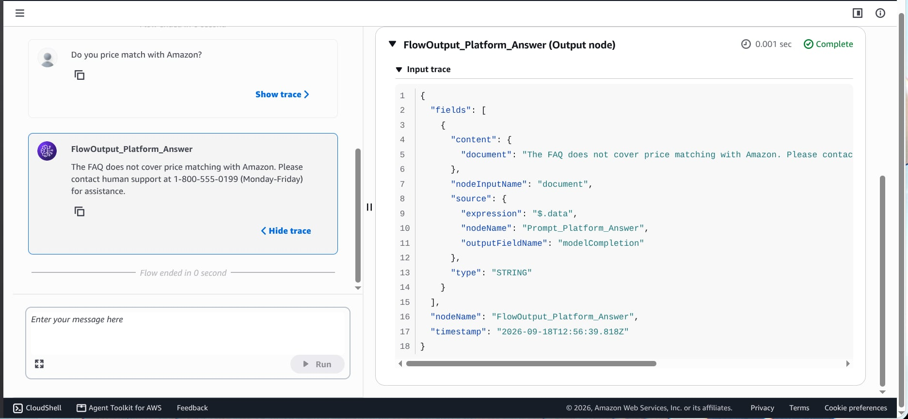
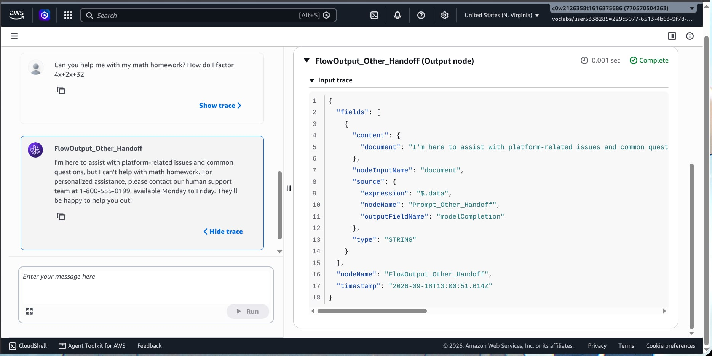
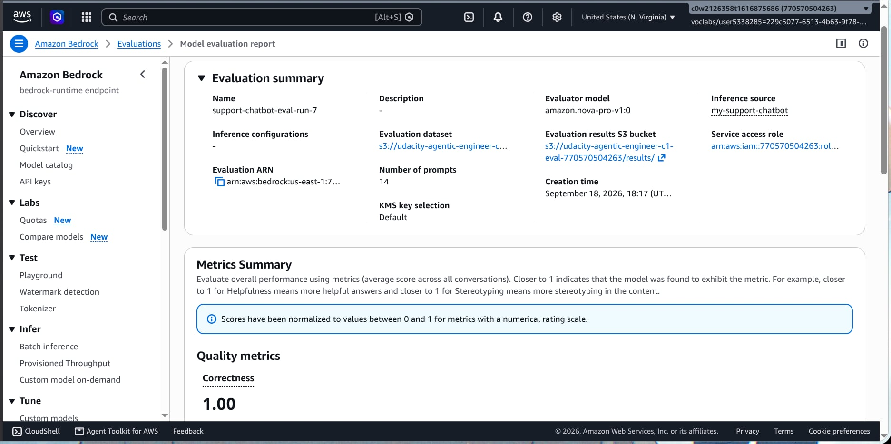

# CustomSupportBot

A customer-support chatbot for a fictional online shop, built on **Amazon
Bedrock AgentCore** for the Udacity ND905 "Prompting LLM Reasoning" (C1)
project. It answers platform questions from the product FAQ, collects bug
reports through a tool, and is evaluated with LLM-as-a-judge. A separate
**Amazon Bedrock Flow** demonstrates the required stateless
classify-and-route behavior with distinct output nodes.

## How it works

```
 user ──▶ chat.py ──▶ Bedrock AgentCore harness (invoke_harness, streaming)
                          │  model: Amazon Nova Pro (us.amazon.nova-pro-v1:0)
                          │  system prompt: conversation rules + FAQ embedded
                          │
                          ├─ FAQ question ──▶ answered directly from the prompt
                          │
                          └─ bug report ──▶ AgentCore Gateway (MCP)
                                               └─ create_bug_report tool
                                                    └─ AWS Lambda
                                                         └─ DynamoDB ticket table
```

- The **harness** is created/updated by `src/create_harness.py` from
  `src/system_prompt.txt` (with `{{FAQ}}` replaced by the FAQ contents) and
  pinned to Nova Pro. Managed memory is disabled on purpose: retrieved
  memories from other sessions leaked "already provided" bug details.
- The **gateway** (`src/setup_gateway.py`) exposes the bug-report Lambda as an
  MCP tool with an explicit input schema; IAM propagation delays are retried.
- **Evaluation** (`src/generate-eval-dataset.py`) runs the test suite in
  `flow-tests.json` (fresh session per test) and writes a BYOI JSONL
  dataset consumed by Bedrock Evaluations LLM-as-a-judge
  (`output_eval_dataset.jsonl`, job ARN in `eval_job_arn.txt`).

## Architecture and rubric mapping

The repository contains two complementary implementations:

- **Bedrock Flow `CustomerSupportRouter`** performs stateless message
  classification and routing. It has one classifier prompt, one normalization
  step, one condition node, three route prompts, and three separate output
  nodes.
- **AgentCore harness `support_chatbot`** implements the stateful customer
  experience: multi-turn bug collection, FAQ answers, gateway tool calls, and
  ticket persistence.



| Requested Flow concept | Bedrock Flow implementation |
| --- | --- |
| Classifier prompt | `Prompt_Classify_Customer_Message` in `src/bedrock-flow-definition.json` |
| Normalization | `InlineCode_Normalize_Category` strips whitespace and uppercases the result |
| Condition expressions | `Condition_Route_Customer_Message`: `IsBugReport`, `IsPlatformQuestion`, and `default` |
| Bug-report output | `FlowOutput_Bug_Report` |
| FAQ output | `FlowOutput_Platform_Answer` |
| Other-request output | `FlowOutput_Other_Handoff` |

The Flow’s bug path starts intake with one follow-up question; completed
DynamoDB tickets remain the responsibility of the AgentCore harness path.

## Repository layout

| Path | Contents |
|------|----------|
| `src/` | All application and tooling code — run everything from here |
| `infra/` | CloudFormation templates (tool stack: Lambda + DynamoDB + IAM; testing stack) |
| `docs/udacity-project-brief.md` | Original project assignment (reference) |
| `docs/evidence/` | Reproducible visual-evidence renderings and provenance notes |
| `ATTRIBUTION.md` | Sources this project was derived from / consulted |
| `LICENSE-UDACITY.md` | License covering the Udacity starter-derived files |

## Setup

Requires an AWS account with Bedrock access (use `us-east-1`), AWS
credentials configured, and Python 3.9+.

```bash
cd src
python3 -m venv venv && source venv/bin/activate
pip install -r requirements.txt
```

## Usage

All commands run from `src/`, in this order:

```bash
# 1. Deploy the bug-report tool stack (Lambda + DynamoDB + IAM roles)
aws cloudformation deploy \
  --template-file ../infra/cloudformation-tool.yaml \
  --stack-name bug-report-tool-stack \
  --capabilities CAPABILITY_NAMED_IAM \
  --region us-east-1

# 2. Create the gateway and register the bug-report tool
python setup_gateway.py

# 2a. Create or update the Bedrock message-routing flow
python create_flow.py

# 2b. Invoke the deployed Flow alias for one message
python invoke_flow.py --message "What is your return policy?"

# 3. Create/update the harness from system_prompt.txt
python create_harness.py

# 4. Chat
python chat.py                       # interactive
python chat.py --message "Where do you ship?"   # one-shot

# 5. Regenerate the evaluation dataset after prompt changes
python generate-eval-dataset.py --tests-json flow-tests.json
```

State (gateway/harness ARNs) is cached in `src/agentcore_config.json`; the
Flow ID, version, and alias are cached in `src/flow-config.json`. The
scripts are idempotent and reuse existing resources on re-run.

## Testing & evaluation

The suite in `src/flow-tests.json` covers all three routes plus edge
cases: covered FAQ questions (return policy, shipping cost, payment
declines), the covered/uncovered boundary ("my package hasn't arrived" is a
FAQ question, not a bug), uncovered questions, two out-of-scope requests, a
one-word ambiguous message, a mixed bug+question message, two prompt
injection attempts (direct and roleplay), and a non-English FAQ question.
Each test runs in a fresh harness session. Despite its name,
`src/flow-tests.json` is the chatbot test suite; the Bedrock Flow itself is
defined in `src/bedrock-flow-definition.json`. The deployed Bedrock Flow is
smoke-tested separately; representative invocations and their terminal output
nodes are archived in `src/transcripts/flow_route_tests.txt`.

```bash
cd src
python generate-eval-dataset.py --tests-json flow-tests.json   # -> output_eval_dataset.jsonl
aws s3 cp output_eval_dataset.jsonl s3://<EvalDatasetBucketName>/output_eval_dataset.jsonl
aws bedrock create-evaluation-job ...   # Builtin.Correctness, judge amazon.nova-pro-v1:0
```

Evaluation runs (LLM-as-a-judge, `Builtin.Correctness`, 14 records):

| Run | Job | Score | Notes |
|-----|-----|-------|-------|
| 1 | `ewmr6a2exbie` | 0.964 (13/14) | Mixed bug+question reply didn't answer the FAQ part |
| 2 | `p5cxed5smz99` | 0.929 (13/14) | "it doesn't work" filed a ticket from a vague description |
| 3 | `hlzpmetxmlou` | 0.893 (12/14) | One transient Nova `ToolUse` stream error; mixed reply again |
| 4 | `yrq7cp9qun11` | 1.000 (14/14) | After description-clarity gate + FAQ-in-same-reply rule |
| 5 | `hdmyub0q6ezl` | 0.893 (12/14) | Temperature 0 didn't stop two flaky behaviors |
| 6 | `62zdjck1kjmn` | 1.000 (14/14) | After few-shot examples for mixed-intent and OTHER redirect |
| **7 (final)** | `0hs2a520ccts` | **1.000 (14/14)** | Final prompt, reconciled gateway schema, and normalized Lambda validation |

All seven jobs ran on the same dataset schema; per-record results for the
final run are archived in `src/transcripts/eval_run7_results.jsonl`.

## Observations

What moved the score, and why:

1. **Managed memory was the biggest hidden failure mode.** With managed
   memory enabled, the harness retrieved details from *previous sessions*
   (e.g. steps/environment captured in an earlier demo) and treated them as
   "already provided", then invented the rest — filing tickets that violated
   the collection gate. Disabling memory (`memory: {"disabled": {}}`) and
   relying on runtime-session state fixed multi-turn behavior.
2. **Rules lose to examples.** Prose gates ("never call the tool before all
   three fields") still leaked eager tool calls on Nova Pro. A short
   scripted example conversation in the prompt eliminated them entirely.
3. **Few-shots also fixed routing variance** on mixed bug+question messages
   and on the phone-line redirect format (the model kept dropping the
   number until an example pinned it).
4. **A vague description is not a complete description.** Adding a
   description-clarity rule to the completion gate stopped tickets filed
   from one-liners like "it doesn't work".
5. **`temperature: 0.0` improved determinism but not enough alone** — the
   last two failure modes only disappeared with the few-shot examples.
6. **Transient model errors happen.** One run lost a record to Nova's
   "invalid sequence as part of ToolUse" stream error; regenerating the
   dataset and re-running the job is the right response.
7. **Bug-route eval tests can write real tickets.** Misrouted bug tests
   created garbage DynamoDB rows during runs 2–5; after the rebuilt run,
   the table contains exactly one intentionally created chatbot ticket.
8. **Final hardening combined prompt placement and tool validation.**
   Repeating the authorization constraint at the end of the prompt reduced
   premature tool calls, while HTML-decoding plus invisible-character
   normalization lets Lambda reject encoded blank fields. The gateway setup
   also reconciles the live tool schema on every run.
9. **The Flow needed its own normalization and fallback.** Bedrock compares
   condition values exactly, so an InlineCode node strips and uppercases the
   classifier response. The `default` branch safely handles `OTHER` and any
   unexpected classifier value.
10. **The Flow uses the regional Nova Pro model ID.** The cross-region
    `us.amazon.nova-pro-v1:0` profile resolved model execution outside
    `us-east-1`; the inline Flow prompts therefore use
    `amazon.nova-pro-v1:0` directly.

Region note: the lab account's service control policy blocks
CloudFormation/DynamoDB/Lambda outside `us-east-1`, and Nova Pro inference
profiles (`us.`-prefixed) only resolve in US regions — so everything is
pinned to `us-east-1` with the direct model ID `us.amazon.nova-pro-v1:0`.

## Evidence for submission

The Bedrock Flow supplies the requested classifier, condition, and output
nodes. The JPEG files below are AWS Console screenshots. The PNG files in
`docs/evidence/` remain available as reproducible, source-backed renderings
for configuration excerpts that do not fit comfortably in one console
viewport.

| Rubric item | Artifact |
|-------------|----------|
| Classification and routing | `docs/evidence/BedrockFlowDiagram.jpeg`, `docs/evidence/ClassifierPromptConfig.jpeg`, `docs/evidence/Condition-nodeExpressions.jpeg`; source-backed supplements `docs/evidence/01-message-routing-flow.png`, `docs/evidence/02-classifier-prompt-configuration.png`, `docs/evidence/03-condition-expressions.png` |
| Flow route smoke tests | `src/invoke_flow.py`, `src/transcripts/flow_route_tests.txt` |
| Bug-report route + collection rules | `src/system_prompt.txt:48-127` |
| Gateway tool registration | `src/setup_gateway.py:23-90`, live target `PT5VUZLFXI` |
| Multi-turn collection + tool call | `src/transcripts/bug_report_multiturn.txt` (`[tool call] bugreports___create_bug_report` on the final turn only) |
| Ticket persisted | `docs/evidence/DynamoDBTable.jpeg` and `docs/evidence/dynamodb-ticket-scan.json` |
| FAQ prompt template + embedded FAQ | `docs/evidence/FAQPromptNode.jpeg`; full-template supplement `docs/evidence/05-faq-prompt-template.png` |
| Covered, uncovered, and other-request responses | `docs/evidence/FlowTestFAQCovered.jpeg`, `docs/evidence/FlowTestFAQUncovered.jpeg`, `docs/evidence/FlowTestFAQOther.jpeg`, plus `src/transcripts/flow_route_tests.txt` |
| Test suite covers 3 routes | `src/flow-tests.json` |
| JSONL dataset | `src/output_eval_dataset.jsonl` (also in S3) |
| Evaluation job results | `docs/evidence/BedrockEvaluations.jpeg` and `src/transcripts/eval_run7_results.jsonl` |
| Written observations | This README ("Observations" section) |

### Visual evidence











## Cleanup

Not yet run — resources are kept live until the submission screenshots are
taken. When done:

```bash
python cleanup_agentcore.py          # harness, gateway target, gateway
aws s3 rm s3://udacity-agentic-engineer-c1-eval-770570504263 --recursive
aws cloudformation delete-stack --stack-name bug-report-testing-stack --region us-east-1
aws cloudformation delete-stack --stack-name bug-report-tool-stack --region us-east-1
```

Delete the Bedrock Flow separately, after removing its aliases and published
versions:

```bash
FLOW_ID=$(python -c 'import json; print(json.load(open("src/flow-config.json"))["flow_id"])')
for ALIAS_ID in $(aws bedrock-agent list-flow-aliases \
  --flow-identifier "$FLOW_ID" \
  --query 'flowAliasSummaries[].id' \
  --output text \
  --region us-east-1); do
  aws bedrock-agent delete-flow-alias \
    --flow-identifier "$FLOW_ID" \
    --alias-identifier "$ALIAS_ID" \
    --region us-east-1
done
for VERSION in $(aws bedrock-agent list-flow-versions \
  --flow-identifier "$FLOW_ID" \
  --query 'flowVersionSummaries[?version!=`DRAFT`].version' \
  --output text \
  --region us-east-1); do
  aws bedrock-agent delete-flow-version \
    --flow-identifier "$FLOW_ID" \
    --flow-version "$VERSION" \
    --region us-east-1
done
aws bedrock-agent delete-flow \
  --flow-identifier "$FLOW_ID" \
  --region us-east-1
```

## Attribution & license

Content derived from other sources (Udacity's starter template) and the
documentation consulted are recorded in
[ATTRIBUTION.md](./ATTRIBUTION.md). Starter-derived files remain subject to
Udacity's license ([LICENSE-UDACITY.md](./LICENSE-UDACITY.md)); all other
code is the author's own work.
